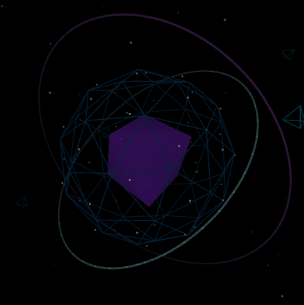

# NIRVAN '26 — Comprehensive Master Project Documentation

> **Event**: NIRVAN '26 — Flagship Annual College Technical Fest  
> **Institution**: Graphic Era Hill University (GEHU Campus), Dehradun  
> **Tagline**: *"Where Ideas Become Innovations"*  
> **Theme**: Cyberpunk Tech, Deep Space, High-Stakes Competitions, Community  

---

## 📑 Table of Contents
1. [Executive Summary & Event Vision](#1-executive-summary--event-vision)
2. [Technology Stack & Architecture](#2-technology-stack--architecture)
3. [Complete Component Breakdown](#3-complete-component-breakdown)
4. [3D WebGL Holographic Engine](#4-3d-webgl-holographic-engine)
5. [Dual Audio Architecture](#5-dual-audio-architecture)
6. [CSS-Only Infinite Scrolling Carousels](#6-css-only-infinite-scrolling-carousels)
7. [Registration & Holographic Ticket System](#7-registration--holographic-ticket-system)
8. [Design System, Color Tokens & Typography](#8-design-system-color-tokens--typography)
9. [API Schema & Database Architecture](#9-api-schema--database-architecture)
10. [Local Setup, Build & Deployment Guide](#10-local-setup-build--deployment-guide)
11. [Project Directory Layout](#11-project-directory-layout)

---

## 1. Executive Summary & Event Vision

**NIRVAN '26** is the flagship annual technical fest hosted at **Graphic Era Hill University (GEHU)**. The platform is designed as an immersive, cyberpunk-themed web application that delivers a cinematic digital experience to student innovators, developers, designers, and gamers across India.

### Core Metrics & Scope
- **Expected Footfall**: 5,000+ Attendees from 50+ Universities.
- **Prize Pool**: Over ₹5,00,000 in cash prizes, grants, swags, and internship opportunities.
- **Flagship Competitions**: 36-Hour Hackathon, Capture The Flag (CTF), E-Sports Championship, Treasure Hunt, and Tech Workshops.

---

## 2. Technology Stack & Architecture

```
┌─────────────────────────────────────────────────────────────────────────────┐
│                          Next.js App Router (Client)                        │
│                                                                             │
│  ┌─────────────────────────┐         ┌───────────────────────────────────┐  │
│  │   Root Layout           │         │   Dynamic Three.js WebGL Canvas   │  │
│  │   (app/layout.tsx)      │         │   (components/ThreeScene.tsx)     │  │
│  └────────────┬────────────┘         └─────────────────┬─────────────────┘  │
│               │                                        │                    │
│  ┌────────────▼────────────────────────────────────────▼──────────────────┐  │
│  │                      Master Page Assembly                              │  │
│  │                      (app/page.tsx)                                    │  │
│  └──────┬──────────────────┬──────────────────┬────────────────────┬──────┘  │
│         │                  │                  │                    │         │
│  ┌──────▼──────┐    ┌──────▼──────┐    ┌──────▼──────┐      ┌──────▼──────┐  │
│  │ Hero & HUD  │    │ Event Arena │    │ Schedule &  │      │ Gallery &   │  │
│  │ Countdown   │    │ (Carousel)  │    │ Speakers    │      │ (Carousel)  │  │
│  └──────┬──────┘    └──────┬──────┘    └──────┬──────┘      └──────┬──────┘  │
│         │                  │                  │                    │         │
│  ┌──────▼──────────────────▼──────────────────▼────────────────────▼──────┐  │
│  │  Procedural Audio Synthesizer (Web Audio API) + Soundtrack Player      │  │
│  ├────────────────────────────────────────────────────────────────────────┤  │
│  │  Holographic Ticket Generator Modal (Team & Solo + Canvas Confetti)    │  │
│  ├────────────────────────────────────────────────────────────────────────┤  │
│  │  IntersectionObserver Scroll Reveal Engine + Custom Spring Cursor      │  │
│  └────────────────────────────────────────────────────────────────────────┘  │
└─────────────────────────────────────────────────────────────────────────────┘
```

- **Frontend Core**: [Next.js 14+](https://nextjs.org/) (App Router), React 18, [TypeScript](https://www.typescriptlang.org/)
- **3D Graphics Engine**: [Three.js](https://threejs.org/) (WebGL Canvas, Orbital Gimbal Rings, Starfield Matrix)
- **Styling Architecture**: Vanilla CSS3 Custom Properties with Glassmorphism, GPU-accelerated Keyframe Animations
- **Audio Engine**: Dual System — Native Browser Web Audio API (procedural SFX) + HTML5 Audio streaming (`audio.mpeg`)
- **Interactive FX**: `canvas-confetti`, `lucide-react` icons, IntersectionObserver API

---

## 3. Complete Component Breakdown

### 3.1 [`components/Navbar.tsx`](file:///d:/Web-A-Thon-4.0/components/Navbar.tsx)
- Sticky HUD top bar with blurred glass backdrop.
- Logo badge, navigation links (`#about`, `#events`, `#schedule`, `#speakers`, `#gallery`, `#contact`).
- Live 3-bar animated Equalizer toggle for background audio.
- Quick "Get Pass" action button triggering the registration modal.

### 3.2 [`components/Hero.tsx`](file:///d:/Web-A-Thon-4.0/components/Hero.tsx) & [`components/Countdown.tsx`](file:///d:/Web-A-Thon-4.0/components/Countdown.tsx)
- Hacker text decoder animation scrambling characters to reveal `"NIRVAN '26"`.
- Precision countdown timer synchronized to October 24, 2026 at 09:00:00 AM IST.
- Real-time days, hours, minutes, and seconds units with zero padding and micro-ticks.

### 3.3 [`components/AboutSection.tsx`](file:///d:/Web-A-Thon-4.0/components/AboutSection.tsx)
- Campus lore and history at Graphic Era Hill University.
- 4 Core Pillars: **Innovate**, **Compete**, **Connect**, **Elevate**.
- Dynamic stats counter showcasing attendees, colleges, prize pool, and hackathon hours.

### 3.4 [`components/VideoSeparator.tsx`](file:///d:/Web-A-Thon-4.0/components/VideoSeparator.tsx)
- High-definition video separator (`public/black_hole.mp4`) with glass overlay.
- Parallax depth dividing the introduction from the competition arena.

### 3.5 [`components/EventArena.tsx`](file:///d:/Web-A-Thon-4.0/components/EventArena.tsx)
- **CSS-Only Infinite Scrolling Carousel** with pause-on-hover effect.
- Features all 5 official event posters:
  1. **Hackathon** (`/posters/Hackathon.jpeg` — ₹15,000 Prize)
  2. **CTF Challenge** (`/posters/CTF.jpeg` — ₹5,000 Prize)
  3. **E-Sports Arena** (`/posters/Esports.jpeg` — ₹10,000 Prize)
  4. **Treasure Hunt** (`/posters/Treasure_hunt.jpeg` — ₹8,000 Prize)
  5. **Tech Workshop** (`/posters/Workshop.jpeg` — Swags & Certs)
- Clicking any card opens a detailed portal modal containing timing, venue, entry fees, complete rules list, and a direct "Register" trigger.

### 3.6 [`components/Schedule.tsx`](file:///d:/Web-A-Thon-4.0/components/Schedule.tsx)
- Dual-day agenda switcher (**Day 01: Oct 24** vs **Day 02: Oct 25**).
- Chronological timeline cards with exact stages, status badges, and session descriptions.

### 3.7 [`components/Speakers.tsx`](file:///d:/Web-A-Thon-4.0/components/Speakers.tsx)
- Grid showcase of keynote presenters, industry judges, and tech mentors with company badges and social links.

### 3.8 [`components/EventsGallery.tsx`](file:///d:/Web-A-Thon-4.0/components/EventsGallery.tsx)
- **Dual-Row Alternating Infinite Carousel**:
  - **Row 1**: Leftward scrolling (`@keyframes galleryInfiniteScroll`).
  - **Row 2**: Reverse rightward scrolling (`@keyframes galleryInfiniteScrollReverse`).
- 13 High-resolution event photographs from previous editions.
- Fullscreen Lightbox Modal Portal with high-definition zoom and caption tags.

### 3.9 [`components/Sponsors.tsx`](file:///d:/Web-A-Thon-4.0/components/Sponsors.tsx) & [`components/ContactSection.tsx`](file:///d:/Web-A-Thon-4.0/components/ContactSection.tsx)
- Tiered partner directory (Title, Platinum, Gold, Community).
- Interactive query form and campus map coordinates for Graphic Era Hill University.

### 3.10 [`components/RegisterModal.tsx`](file:///d:/Web-A-Thon-4.0/components/RegisterModal.tsx)
- Complete registration modal supporting both **Team** and **Solo** entries.
- Input validation for emails, phone numbers, and student IDs.
- Instant **Holographic Hacker Pass Generation** with custom serial ID (`#NIRVAN26-XXXX-XXX`), SVG QR code, and celebratory multi-color confetti explosion.

### 3.11 [`components/CustomCursor.tsx`](file:///d:/Web-A-Thon-4.0/components/CustomCursor.tsx) & [`components/ScrollReveal.tsx`](file:///d:/Web-A-Thon-4.0/components/ScrollReveal.tsx)
- Spring-physics interpolated custom cursor tracking mouse velocity.
- Directional IntersectionObserver scroll transitions (`fade`, `up`, `left`, `right`).

---

## 4. 3D WebGL Holographic Engine

- **File**: [`components/ThreeScene.tsx`](file:///d:/Web-A-Thon-4.0/components/ThreeScene.tsx)
- **SSR Isolation**: Dynamically loaded via Next.js `{ ssr: false }` to ensure zero hydration mismatch.
- **Scene Objects**:
  - **Quantum Core**: Wireframe 3D Icosahedron with cyan nodes.
  - **Pulsating Crystal**: Rotating internal Octahedron with neon magenta reflection.
  - **Orbital Gimbal Rings**: Dual orthogonal tori rotating on multi-axes.
  - **Starfield Matrix**: 2,200+ particle stars reacting dynamically to mouse coordinates.
- **Optimization**: DPR clamped to `Math.min(window.devicePixelRatio, 2)` to guarantee 60 FPS performance across GPUs.

---

## 5. Dual Audio Architecture

1. **Procedural Web Audio Synthesizer ([`lib/audio.ts`](file:///d:/Web-A-Thon-4.0/lib/audio.ts))**:
   - Zero-download sound synthesis using native browser `AudioContext`.
   - Hover Chimes: 800Hz → 1200Hz sine wave sweep.
   - Click Pulses: 320Hz → 80Hz sub-bass click.
   - Modal Open: 180Hz → 880Hz sawtooth warp swoosh.
   - Pass Celebration: Arpeggiated C-major chord synth.
2. **Ambient Soundtrack Player ([`components/AudioPlayer.tsx`](file:///d:/Web-A-Thon-4.0/components/AudioPlayer.tsx))**:
   - Streams `public/audio.mpeg` in the background with persistent volume control and equalizer visualization in the header.

---

## 6. CSS-Only Infinite Scrolling Carousels

Both the **Event Arena** and **Gallery** utilize pure CSS keyframe translation without JavaScript ticker overhead:

```css
.event-carousel-wrapper {
  position: relative;
  width: 100vw;
  left: 50%;
  margin-left: -50vw;
  overflow: hidden;
  mask-image: linear-gradient(to right, transparent, rgba(0,0,0,1) 8%, rgba(0,0,0,1) 92%, transparent);
}

.event-carousel-track {
  display: flex;
  width: max-content;
}

.event-carousel-group {
  display: flex;
  gap: 2rem;
  padding-right: 2rem;
  animation: eventInfiniteScroll 30s linear infinite;
}

/* Pause on Hover */
.event-carousel-wrapper:hover .event-carousel-group {
  animation-play-state: paused !important;
}

@keyframes eventInfiniteScroll {
  0%   { transform: translateX(0); }
  100% { transform: translateX(-100%); }
}
```

---

## 7. Registration & Holographic Ticket System

1. Participant enters Team Name, Leader details, and Member information.
2. Form validates fields and generates a cryptographic participant hash (e.g. `#NIRVAN26-8942-HACK`).
3. Holographic badge rendered on-screen with attendee credentials, QR code, and ticket serial number.
4. Celebratory multi-color confetti explosion triggered via `canvas-confetti`.
5. One-click "Print / Save Badge" functionality.

---

## 8. Design System, Color Tokens & Typography

### CSS Custom Properties ([`app/globals.css`](file:///d:/Web-A-Thon-4.0/app/globals.css))
- `--bg-primary`: `#030712` (Void Deep Black)
- `--cyan-core`: `#00f0ff` (Cyber Cyan Accent)
- `--purple-core`: `#8b5cf6` (Electric Violet)
- `--neon-pink`: `#ec4899` (Magenta Glow)
- `--green-core`: `#10b981` (Emerald Matrix)
- `--amber-core`: `#ffb800` (Gold Trophy Accent)

### Typography
- **Heading**: `'Orbitron', sans-serif` (Futuristic Cyber HUD font)
- **Monospace**: `'Fira Code', 'JetBrains Mono', monospace` (Timers & Code Badges)
- **Body**: `'Inter', sans-serif` (Clean readability)

---

## 9. API Schema & Database Architecture

### Registration Payload (`POST /api/register`)
```json
{
  "registrationType": "team",
  "event": "hackathon",
  "teamName": "CyberKnights",
  "teamLeader": {
    "name": "Ankush Rao",
    "email": "ankush@gehu.ac.in",
    "phone": "+91 9876543210",
    "college": "Graphic Era Hill University"
  },
  "members": [
    { "name": "Team Member 1", "email": "member1@gehu.ac.in" }
  ]
}
```

---

## 10. Local Setup, Build & Deployment Guide

```bash
# 1. Clone repository
git clone https://github.com/kernelcorestudio/Web-A-Thon-4.0.git
cd Web-A-Thon-4.0

# 2. Install dependencies
npm install

# 3. Start local development server
npm run dev

# 4. Build for production
npm run build
npm start
```

### Deploying to Vercel
Connect your repository on [Vercel](https://vercel.com). The project requires zero custom build configurations — Vercel detects Next.js App Router automatically.

---

## 11. Project Directory Layout & Raw Media Assets

> [!NOTE]
> 📁 **Central Media & Raw Assets Repository**: All project multimedia assets, high-definition videos, audio soundtracks, official branding, competition posters, and event photographs are organized within the **[`components/assests/`](file:///d:/Web-A-Thon-4.0/components/assests/)** and **[`public/`](file:///d:/Web-A-Thon-4.0/public/)** directories:
> - 🎥 **Videos**: `components/assests/hero.mp4`, `components/assests/black_hole.mp4`, `public/Drone.mp4`
> - 🎵 **Audio**: `components/assests/audio.mpeg`, `public/audio.mpeg`
> - 🖼️ **Posters & Tracks**: `components/assests/events/poster/` (Hackathon, CTF, Esports, Treasure Hunt, Workshop)
> - 📸 **Event Gallery**: `components/assests/events/` (13 High-Resolution Event Photographs)
> - 🌌 **3D Graphics & Branding**: `public/3D.png`, `components/assests/logo.png`, `components/assests/form_bg.jpeg`

```

Web-A-Thon-4.0/
├── app/
│   ├── globals.css          # Master cyberpunk design tokens & keyframes
│   ├── layout.tsx           # Root HTML layout, Google Fonts & SEO metadata
│   └── page.tsx             # Master page assembling all interactive sections
├── components/
│   ├── AboutSection.tsx     # Lore, pillars, stats & fest vision
│   ├── AudioPlayer.tsx      # Ambient background music player & equalizer
│   ├── ContactSection.tsx   # Contact inquiry form & campus coordinates
│   ├── Countdown.tsx        # Synchronized live countdown timer
│   ├── CustomCursor.tsx     # Spring-interpolated interactive cursor
│   ├── EventArena.tsx       # CSS-only Infinite Carousel of event posters & modal
│   ├── EventsGallery.tsx    # Dual-row CSS-only Infinite Carousel of photos
│   ├── Footer.tsx           # Social links & copyright
│   ├── Hero.tsx             # Scramble title, HUD stats & fast CTA
│   ├── Navbar.tsx           # Sticky HUD header & audio equalizer toggle
│   ├── RegisterModal.tsx    # Team/Solo registration & ticket generator
│   ├── Schedule.tsx         # Day 1 & Day 2 chronological agenda
│   ├── ScrollReveal.tsx     # Directional scroll reveal triggers
│   ├── Speakers.tsx         # Industry mentors, judges & speakers
│   ├── Sponsors.tsx         # Partner tier cards
│   ├── ThreeScene.tsx       # Three.js 3D WebGL Holographic Quantum Core
│   └── VideoSeparator.tsx   # Black hole cinematic video separator
├── lib/
│   └── audio.ts             # Procedural Web Audio API sound synthesizer
├── public/
│   ├── audio.mpeg           # Ambient background soundtrack
│   ├── black_hole.mp4       # Cinematic black hole video
│   ├── hero.mp4             # Hero backdrop video
│   ├── events/              # 13 High-res fest photographs
│   └── posters/             # 5 Official competition posters
├── docs/                    # Complete documentation suite
│   ├── PROJECT_DOCUMENTATION.md # Master consolidated project documentation
│   ├── architecture.md      # WebGL & system architecture
│   ├── features.md          # Feature specifications & breakdown
│   ├── design_system.md     # Color hierarchy & typography
│   ├── api_and_integration.md # API models & database schema
│   ├── troubleshooting_and_faq.md # SSR, audio & runtime FAQ
│   └── setup_and_usage.md   # Setup & deployment guide
├── plan/
│   ├── implementation_plan.md
│   ├── roadmap.md
│   └── release_checklist.md
├── package.json
├── tsconfig.json
└── README.md
```

---

## 🌌 3D Holographic Quantum Core Visual Showcase

<p align="center">
  
</p>


